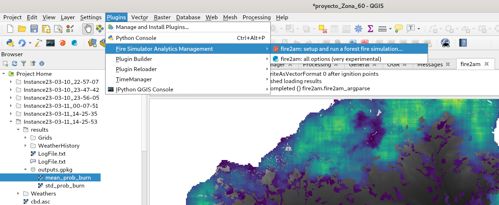

# Cell 2 Fire QGIS plugin

This repo contains a [QGIS](https://qgis.org) [plugin](https://plugins.qgis.org/) for graphically interfacing with Cell2Fire [SB](https://github.com/fire2a/C2FSB) simulator.  
Choose your guide:
- [User](readme_user.md)
- [Developer](readme_dev.md)

## Quickstart
### Install
0. Have QGIS installed (developed using 3.1 long term version)  
1. Download or clone the repo, put in your qgis plugin folders  
    - Linux: `~/.local/share/QGIS/QGIS3/profiles/default/python/plugins/fire2am`
    - Windows: `C:\Users\ \AppData\Roaming\QGIS\QGIS3\profiles\default\python\plugins\fire2am`
2. Compile cell2fire c++ binary if not available
2. Install python3 dependencies `pip install -r requirements.txt` 
3. Activate the plugin:  
    - QGIS Menu > Plugins > Manage and Install Plugins > All  
    - type 'fire', select 'Fire Simulator Analytics Management'  
    - click 'Install Plugin'  
Now you have a new icon on the plugin toolbar and a new plugin menu.  
### Usage  
0. Open & save a qgis project  
1. At least have a fuel raster layer in ascii AAIGrid format, according to Scott & Burgan fuels [definition](spain_lookup_table.csv)  
2. Set project & layers CRS  
3. Open the dialog, setup the layers, ignitions, weather & click Run!  
### Update  
This plugin uses Cell2Fire [SB](https://github.com/fire2a/C2FSB) as a submodule  
```
# update plugin
git pull
# update cell2fire submodule (only the first time)
git submodule update --recursive --remote  
# update cell2fire submodule
git submodule update --init --recursive 
```

## Screenshot  

0. On the Plugin Menu this plugin is shown selected  
1. Its icon is also available on the Plugin Toolbar   
2. Along other very useful plugins:  
    - Plugin Builder : For developers wanting a minimal working plugin template  
    - Plugin Reloader : If the provided Restore Defaults button doesn't work, use this  
    - Time Manager : For earlier versions of QGIS (<3.2) this is needed for animating the fire isochrones (merged fire evolution layer)  
    - IPython QGIS Console : A introspection capable ipython session based on qtconsole  

## Known issues  
- Don't close the current project with the dialogs opened  
