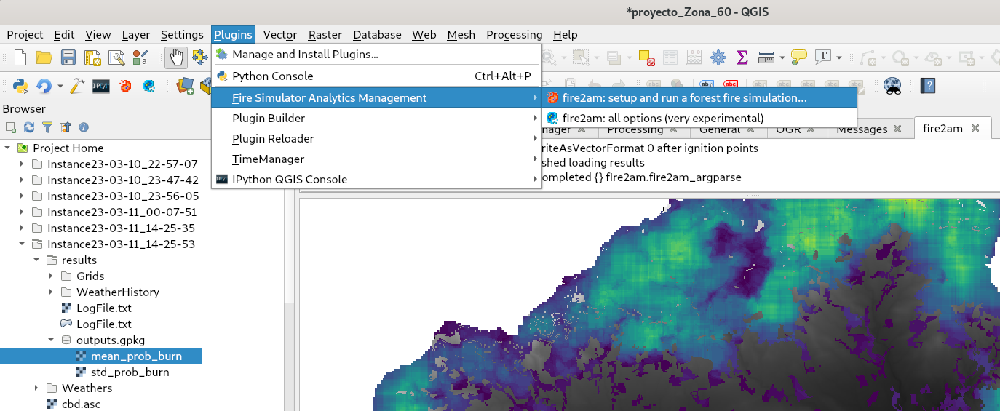

        Fire Advanced Analytics & Management
        
                 fire2am QGIS plugin
                
            by fire2a.com research centre

This repo contains a  [QGIS plugin](https://plugins.qgis.org/) for graphically interfacing with [Cell2Fire Scott & Burgan](https://github.com/fire2a/C2FSB) forest fires simulator, test cases and a few extras.  

The softwares enables you to simulate thousand of forest fires on any landscape, provided a fuel raster -with Scott and Burgan fuel types; and [QGIS](https://qgis.org). 

With the bare minimun input being a forest fuels raster. Other spatial inputs can include: an elevation layer; canopies base height, bulk density and fraction cover; also ignition probabilities, weather scenarios, moisture content, protection values, etc.

A cup-of-coffee run length is around a 500x500 sized raster with 50 simulations on a modern laptop. Each fire simulation runs in parallel, though the overall load to the computer can be adjusted via the 'number of threads' parameter (see 'Optional Rules' tab).

Several outputs are available:  
1. Ignition point(s)
2. Fire scars:  
    2.1 Final or every n periods  
    2.2 Animated isochrone  
    2.2 Burn probability map (\>1 simulation)  
3. Spatial statistics:  
   3.1 Flame length  
   3.2 Byram Intensity  
   3.3 Rate of spread  
   3.4 Downstream Protection Value (counting downstream burned cells if no ecological protection value layer is provided)  
   3.5 Betweenness Centrality  
4. Descriptive or numerical statistics (see 'Tables' tab):  
   4.1 from the spatial ones  
   4.2 runtime statistics  
6. Plots (see 'Tables' tab):  
  (WIP)

Spatial outputs are shown and stored as geopackages (*.gpkg) along everything needed for reproducing the simulation(s) experiment.

Currently the FIRE-RES team is working on a firebreak placement feature: Including  landspace clustering (for automatically infering management units) and stochastic network disrupting algorithms! Contact us at: fire2a@fire2a.com!

[Install](#installation) then, choose your guide:
- [User ](readme_user.md)
- [Expert ](readme_dev.md)

# Installation
_Most sections have a .gif animation executing the instructions, so read till the end before executing._

## Overview

1. Install/update QGIS
2. Install the plugin requirements (on QGIS's python environment)  

Using QGIS's plugin manager interface:  

3. Add fire2a plugin repository
4. Install the plugin
  
B. Contingencies  
1. Cell2Fire binary compatibility: See per-platform compiling instructions.  
2. Network access problem to plugin repository: Ask the fire2a team for a zipped release  

## Choose your platform:
- [__Linux__ ](#linux)🗽
- [MacOS ](#linux)🤡
- [Windows ](#windows)💩

## Windows
1. Install or update QGIS, two alternatives:
   
    A. Download & install QGIS from: https://qgis.org/en/site/forusers/download.html#windows  
    or B. Open a terminal, run: `winget install --id OSGeo.QGIS` follow on screen instructions

2. Install the plugin requirements (on qgis's python). If this fails there's a last resort [here](<#forcing python requirements in QGIS console>)

    2.1 Download [requirements.txt](./requirements.txt)  
    2.2 Run "OsGeo4WShell" from the start menu  (Start > type 'osgeo' Enter)  
    2.3 Enter `pip install -r "%USERPROFILE%\Downloads\requirements.txt"` (Modify the path to requirements file if needed; tip: 2dary click to paste in terminal)  
   
4. Add fire2a's plugin repository:

    3.1 Open QGIS  
    3.2 Menu Bar: Plugins > Manage and Install Plugins... > Settings > Add... (button at the bottom right of Plugin Repositories section)  
    3.2 "Repository details" dialog opens. Fill inputs:  
        "Name": any, though "Fire2a" is suggested  
        "URL" input with "https://fdobad.github.io/qgis-plugin-server/plugins.xml"  
   Confirm (Ok button), repos will be reloaded and a success state should be seen from the fire2a repository

5. Install the plugin

   4.1 On the same "Plugins" dialog, click "All" on the left vertical tab.  
   4.2 Type "fire2am" on the Search...  
   4.2 Select it from the list  
   4.3 Click the install button  

| Animated steps 2, 3 & 4 |
| --- |
| 2. Install the plugin requirements (on qgis's python) |
||
| 3. Add fire2a's plugin repository & 4. Install the plugin __(FOR ALL PLATFORMS!!)__ <a id="my-anchor"></a> |
||

## Windows contingencies
### B.1. Compiling
See `fire2am/C2FSB/Cell2FireC/README_VisualStudio.md`
### B.2. Zipped release
The zipped file is under 25MB so should be deriverable via e-mail  
__This replaces step 3 of [normal instructions](#windows)__  
1. Unzip it or extract contents, a new folder will appear `fire2am_v1.2.3\fire2am`  
2. Copy or move the `fire2am` folder into `%APPDATA%\QGIS\QGIS3\profiles\default\python\plugins\`  (tip: paste this direction in explorer.exe address bar)

## Linux 🗽
1. Install QGIS https://qgis.org/en/site/forusers/alldownloads.html#linux
2. Install the plugin requirements (on qgis's python environment)  
2.1 Download [requirements.txt](./requirements.txt)  
2.A Bad practice: install directly into python env  
```
$ pip install --upgrade pip wheel setuptools
$ pip install -r requirements.txt
$ pip install --upgrade matplotlib
```  
    2.B Good practice: Make a python virtual environment (python3-venv required)
```
$ mkdir ~/<your_qgis_env_path>
$ python3 -m venv --system-site-packages ~/<your_qgis_env_path>  
$ source ~/<your_qgis_env_path>/bin/activate
(your_env) $ pip install --upgrade pip wheel setuptools  
(your_env) $ pip install -r requirements.txt  
(your_env) $ pip install --upgrade matplotlib

# launch QGIS:
(your_env) $ qgis
```
    2.B Optional tip: Make aliases to activate & launch
```
echo 'alias pyqgis="source ~/<your_qgis_env_path>/bin/activate"'>>~/.bashrc  
echo 'alias qgis="source ~/<your_qgis_env_path>/bin/activate && qgis"'>>~/.bashrc
```
3. [Add fire2a plugin repository](#my-anchor)
4. [Install the plugin](#my-anchor)

## Linux contingencies
### B.1. Compiling
```
# apt install g++ libboost-all-dev libeigen3-dev
$ cd ~/.local/share/QGIS/QGIS3/profiles/default/python/plugins/fire2am/C2FSB/Cell2FireC
$ make
```
If it fails, most likely is because `$EIGENDIR != /usr/include/eigen3/`. Check where your distribution installs `eigen`:
```
nice find / -readable -type d -name eigen3 2>/dev/null
```
Edit `makefile` accordingly, try again: `make clean && make`

### B.2. Zipped release
The zipped file is under 25MB so should be deriverable via e-mail  
__This replaces step 3 of [normal instructions](#windows)__  
1. Unzip it or extract contents, new directory `fire2am_v1.2.3\fire2am`  
2. Copy, move or symlink the `fire2am` folder into `~/.local/share/QGIS/QGIS3/profiles/default/python/plugins/`

## TODO MacOS
    
## Common *NIX problems
If you didn't compile, the binary might not have execution permission:  
```
cd ~/.local/share/QGIS/QGIS3/profiles/default/python/plugins/fire2am/C2FSB/Cell2FireC
ls -l | grep Cell2Fire # pre check
chmod u+x Cell2Fire
ls -l | grep Cell2Fire # post check
```
## Forcing python requirements in QGIS console
The last resort but very discouraged method to installing packages for the QGIS python environment, inside QGIS:  
1. Launch the [python console](https://docs.qgis.org/2.18/en/docs/user_manual/plugins/python_console.html) by typing `Ctrl+Alt+P` or clicking on the python icon   
2. Write the following commands:  
```
import pip
pip.main(['install', 'my-package-name'])
```
Replace 'my-package-name' and repeat this line with each package from the [requirements.txt](./requirements.txt) file, ignore the warnings and restart QGIS.  

| force pip on python console |
| --- |
||

## Activate
1. QGIS Menu > Plugins > Manage and Install Plugins > All  
2. type 'fire', select 'Fire Simulator Analytics Management'  
3. click 'Install Plugin'  
4. _Optionally install [Plugin Reloader](https://plugins.qgis.org/plugins/plugin_reloader/#plugin-details) to force hard restart the plugin when 🐛bugs🐝🐞 don't go away with the `Restore Defaults` button_  

__Now you have a new icon  on the plugin toolbar and a new plugin menu.__  

| activation |
| --- |
||

_Now you have a new icon  on the plugin toolbar and a new plugin menu._  

If it fails at this stage, it's probably a `ModuleNotFoundError` meaning something -silently- failed installing pip packages (this will be automated on QGIS 3.8).  
- Check [this section](#forcing-python-requirements-in-qgis-console) for a last resort.  
- Please report the output of `install_debug.bat` to the fire2a team first.  

## Like ⭐ and subscribe to get notified of new releases


# Broadest Usage Overview  
0. Open & save a qgis project  
1. At least have a fuel raster layer in ascii AAIGrid format, according to Scott & Burgan [fuels definition](spain_lookup_table.csv)  
2. Set project & layers CRS (Coordinate Reference System)  
3. Open the dialog (click on ), setup the layers, ignitions, weather on each tab. Click Run!  
4. Wait for the simulation (& postprocessing, although this is done on the background)  
5. Main results will be added as layers (also a folder to reproduce and store all results is made)  

Sample instances are included in the plugin folder `fire2am/C2FSB/data/`  
_Keep reading and then make sure to check the [user guide](readme_user.md)_  

# Screenshot  
  

0. On the Plugin Menu this plugin dialog launcher is shown selected  
1. Its also available on the Plugin Toolbar   
2. Along other very useful plugins -that can be installed directly inside QGIS:  
    - [Plugin Builder](https://plugins.qgis.org/plugins/pluginbuilder3/#plugin-details) : For developers wanting a minimal working plugin template  
    - MUST HAVE! [Plugin Reloader](https://plugins.qgis.org/plugins/plugin_reloader/#plugin-details) : If the plugin provided `Restore Defaults` button doesn't work hard enough, use this  
    - [Time Manager](https://plugins.qgis.org/plugins/timemanager/#plugin-about) : For earlier versions of QGIS (<3.2) this is needed for animating the fire isochrones (merged fire scars evolution layer)  
    - [IPython QGIS Console](http://www.itopen.it/qgis-and-ipython-the-definitive-interactive-console/) : A introspection capable ipython session based on (pip requires) qtconsole  


# Known issues  
- Directories or folders with spaces won't work
- Don't close the current project with the dialogs opened  
- Don't try opening the results directory or geopackage databases (.gpkg) while the simulation is running or while postprocessing  
- Windows version fails around 3564288 cells  

# Keep on reading
- [User guide](readme_user.md)
- [Expert guide](readme_dev.md)
