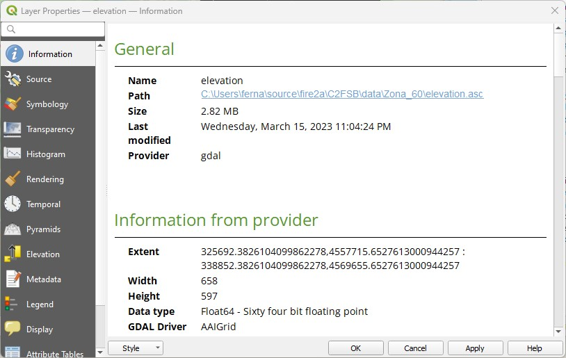
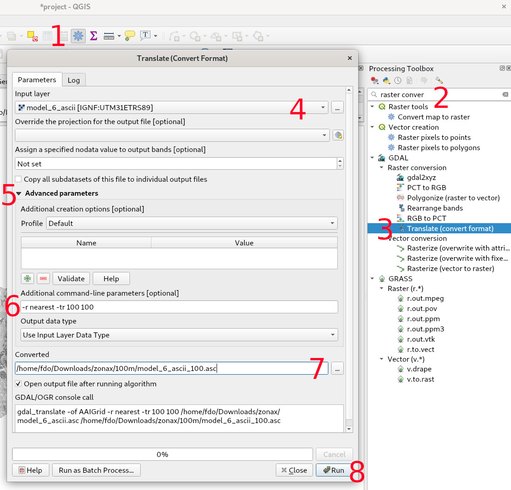
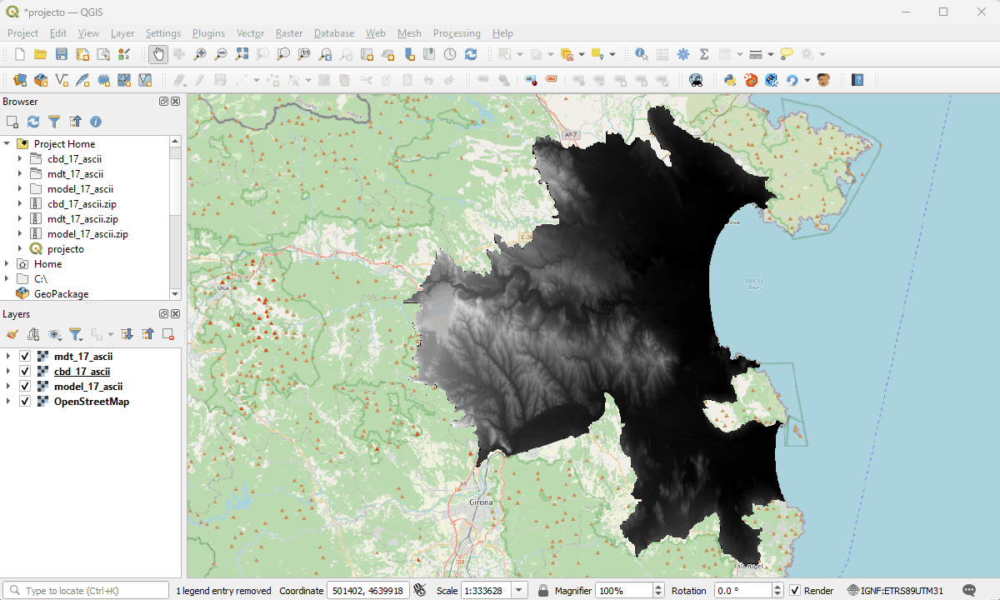
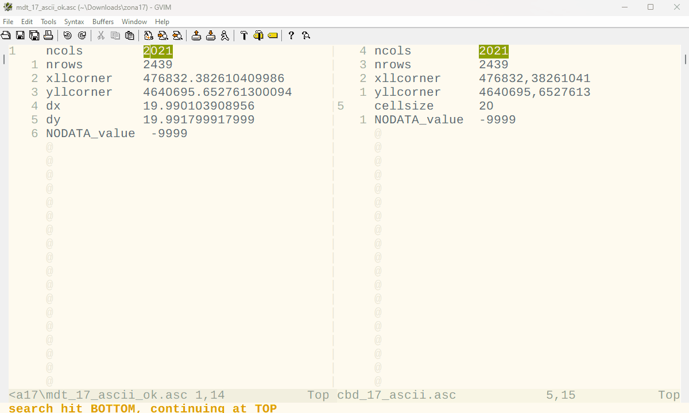

        Fire Advanced Analytics & Management
        
                 fire2am QGIS plugin
                
            by fire2a.com research centre
	    
_This section has a .gifs animations at the end summarizing it._
# Matching and scaling rasters in QGIS

- _If layer sizes don´t match, the simulator won´t run._

Check the sizes by entering into the layer properties dialog: Secondary click over the desired layer -on the layer panel, on the 'Information' tab scroll until finding the info.

| Check: Width, Height & AAIGrid Driver! |
| --- |
|  |

- _If layer sizes are too big, the simulator will take forever._

Downsizing is a technique recomended for quicky iterating in the exploratory phase. Before running very long simulations, test run the same configurations in a smaller instance. The speed will depend mainly on your hardware (CPU cores) and OS.
But around 500x500 pixels x50 fires is a 5 minute run on a average medium tier laptop.

# GDAL Translate
[GDAL translate](https://gdal.org/programs/gdal_translate.html#gdal-translate) is a tool available in QGIS [Processing Toolbox](https://docs.qgis.org/3.28/en/docs/user_manual/processing/toolbox.html) to converts raster data.

- Convert to a specific raster size to match others using `-outsize`, __then manually adjusting the header of the resulting file is needed.__
- To convert fuels rasters, using `-r nearest` is mandatory to stay in the domain.

Basically, the algorithm is configured with these 3 options:
```
       -outsize <xsize>[%]|0 <ysize>[%]|0
              Set the size of the output file.  Outsize is in pixels and lines unless '%' is attached in which case it is as a fraction of the input image
              size.  If one of the 2 values is set to 0, its value will be determined from the other one, while maintaining the aspect ratio of the source
              dataset.

       -tr <xres> <yres>
              set  target  resolution. The values must be expressed in georeferenced units.  Both must be positive values. This is mutually exclusive with
              -outsize and -a_ullr.

       -r {nearest (default),bilinear,cubic,cubicspline,lanczos,average,mode}
              Select a resampling algorithm.
```
So for example, convert to a 1 ha resolution to explore really big areas.
	- `-tr 100 100 -r cubicspline` for elevation
	- `-tr 100 100 -r nearest` for fuel model  
	
Do the following:
 1. Click on the cog  
 2. Write `trans` in the Processing Toolbox search box  
 3. Select `GDAL > Translate (convert format)`  
 4. Select the input layer  
 5. If closed, open the Advanced Parameters section  
 6. Write into the Additional command-line parameters input:  
 ```
 -r nearest 		# For fuel layers
 -tr 100 100		# To scale resolution
 -outsize W H 		# To match to other layer
 ```
 7. Select the output file, must end in `.asc`  
 8. Click Run  
 9. Finally, check the generated header in a text editor, make sure `cellsize` is used instead of `dx dy`


| Summary |
| --- |
|   > |
|  > |
| Change the header (if you used `outsize`)|
|  > |

_Don't forget checking to changing the headers!!_

# Other solutions
## Make a new study area
### 1. Create a polygon

    1.Open QGIS software and add a vector layer to the map canvas.
    Select the “Create a New Layer” option from the Layer menu, or use the keyboard shortcut “Ctrl + Shift + N”.
    2.Choose the Polygon layer type, name the layer, and select the appropriate CRS (Coordinate Reference System).
    3.In the Layer panel, right-click on the newly created polygon layer and select “Toggle Editing.”
    4.Use the “Add Feature” button to start creating your polygon.
    5.Continue drawing the polygon by clicking on the map canvas to set vertices.
    6.Double-click to finish drawing the polygon, and save the changes by clicking on “Save Changes”.
    7.Turn off the editing mode by right-clicking on the polygon layer and selecting “Toggle Editing.”

#### references
https://docs.qgis.org/3.28/en/docs/training_manual/create_vector_data/create_new_vector.html
https://mapscaping.com/how-to-create-a-polygon-qgis/

### 2. Clip all layers to the polygon
Using the Processing Toolbox:  
	Gdal -> Raster Extraction -> Clip raster by mask layer  

## Clip all rasters by the smallest one
Using the Processing Toolbox:  
	1. Vector -> Research Tools -> Extract Layer Extent  
	2. Raster -> Extraction -> Clip raster by extent  

