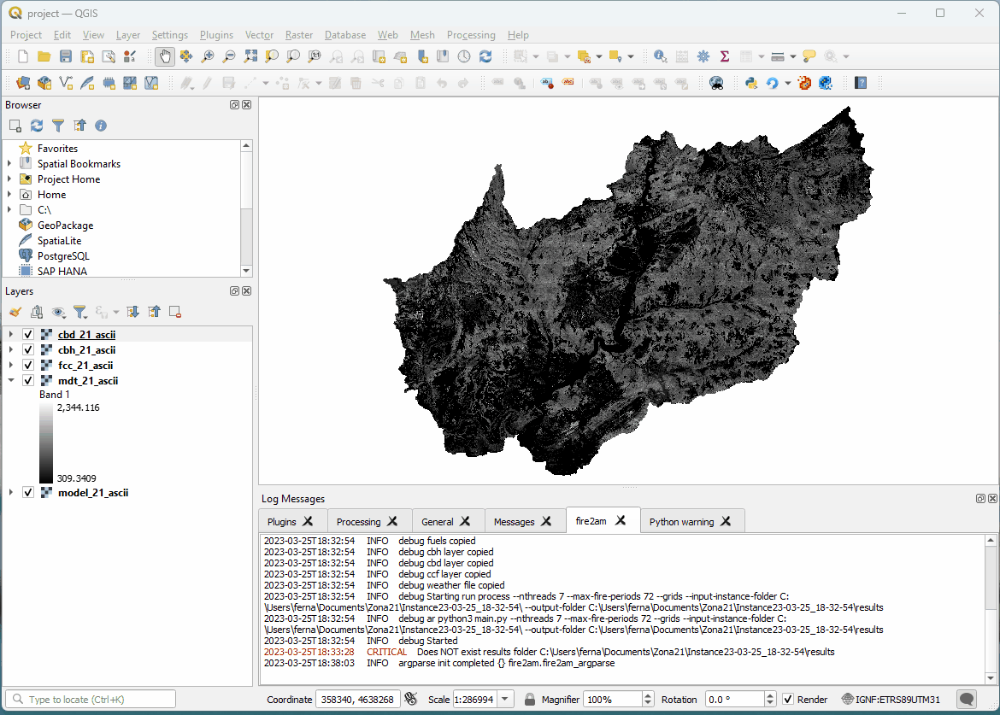

# Developer guide

## The developer dialog

The plugin includes a secundary dialog with the icon ; that works entagled to the main simulator dialog.  
This dialog reads Cell2Fire's argument parser directly and exposes all options in a tree view, enabling the following:  
- Easy selection and modification of all simulator parameters (enabled by its checkbox and modifying its default value) overriding the normal dialog options.  
- A load and save button to persist the working configuration in the project's home folder by a pickle.dump file.  
- A text display showing how the selected command line argument looks according to the user selection  
- A checkbox enabling auto copying the generated command into the clipboard (not enabled by default because has a noticeable performance detriment)  
- A folder selection widget to change where Cell2Fire simulator is located
- A way of circumventing the normal Run process: Avoid the creation of the Instance_timestamp folder by specifying the input and output folder, and then pressing the [dev] button (in the run tab).

| exploring the dev dialog |
| --- |
|  |

## Knowledge roadmap

- pyqgis: Open the python console, use the provided `extras/qgis_sandbox.py` to test commands  
- IPythonQgis : Install the IPython Console plugin (`pip install qtconsole` is required)  
- qgis plugin code: The easiest way to get up to speed with developing QGIS plugins is using the 'Plugin Builder' plugin and build a dialog template  
- qgis plugin ui: Qt Designer comes installed with qgis components  
- cell2fire: Run the included examples, visit https://github.com/fire2a  
Check all the references links at the [end](#required).

## Advanced installing

Get access to the repo:

### Like ⭐ and subscribe to get notified of new releases


Friendly advice: Never run a command if you don't know what it does

#### 0. Install QGIS & open it at least once!  
    # Else plugins directory won't exist  
    # version >=3.1  
    https://qgis.org/en/site/forusers/alldownloads.html  

#### 1. Clone instead of installing  
    # desired place example ~/dev/fire2am-qgis  
    git clone git@github.com:fdobad/fire2am-qgis-plugin.git ~/dev/fire2am-qgis  

#### 2. Create symbolic link to QGIS plugins  
Changes to the code will be reflected after reloading the plugin (except some imports then reload QGIS)  
If by accident, you uninstall QGIS or the plugin, the code wont be affected  

    # link must be named fire2am  
    cd ~/.local/share/QGIS/QGIS3/profiles/default/python/plugins  
    ln -s ~/dev/fire2am-qgis fire2am  

#### 3. Optional, create your own branch on your own repo for contributing, better sooner than later
    cd ~/dev/fire2am-qgis
    git checkout -b awesome_feature
    # fork from web ui
    git remote set-url origin git@github.com:<youruser>/fire2am-qgis-plugin.git
    # push new branch
    git push -u origin <branch>

#### 4. Optional, get the latest C2FSB as git submodule  
The plugin and the simulator are developed in different repos!  

    cd ~/dev/fire2am-qgis
    rm -r C2FSB
    git submodule init
    git submodule add git@github.com:fire2a/C2FSB.git C2FSB
    git submodule update --init --recursive --remote

#### 5. Optional, compile the C2FSB binary
(Windows compiling instructions on C2FSB repo)

    cd ~/dev/fire2am-qgis/C2FSB/Cell2FireC
    sudo apt install g++ libboost-all-dev libeigen3-dev
    make clean
    make
    # If it fails check where your distribution installs eigen. Because the `makefile` assumes `EIGENDIR = /usr/include/eigen3/`  
    # Locate it with `nice find / -readable -type d -name eigen3 2>/dev/null`  
    # Then edit `makefile` accordingly & try again.  
  
#### 6. Install python dependencies
`Python 3.9.2` was used for developing  
##### 6.A. Recommended install into virtual environment  

    mkdir ~/pyenv/pyqgis
    python3 -m venv --system-site-packages ~/pyenv/pyqgis  
    source ~/pyenv/pyqgis/bin/activate
    pip install --upgrade pip wheel setuptools  
    pip install -r requirements.txt  
    pip install --upgrade matplotlib  
    echo 'alias pyqgis="source ~/pyenv/pyqgis/bin/activate"'>>~/.bashrc  
    echo 'alias qgis="source ~/pyenv/pyqgis/bin/activate && qgis"'>>~/.bashrc  
    bash    # alias works after reloading bashrc
    pyqgis  # to activate environment
    qgis    # to launch qgis (you can change the logger default level in fire2am_utils.py)
            # is recommended running qgis from the terminal to see more logs
 
##### 6.Bad. Alternative install into user folders

    # ~/.local/lib/python3 ?
    pip install --upgrade pip wheel setuptools  
    pip install -r ~/dev/fire2am-qgis/requirements.txt  
    pip install --upgrade matplotlib  

## 0. Adding new packages
As this [commit](https://github.com/fdobad/fire2am-qgis-plugin/commit/4640f14b9e71c2663f926f17418ccbe4c55efd0f)explains.  
The plugin loader checks if the following import names in `requirements_import_names.txt` are available.  
If the module is not available, it forces pip to install it, according to the same line in `requirements.txt`.  
Done in a very discouraged way:  

    In [1]: from pip import main as pip_main
    In [2]: pip_main?
    Signature: pip_main(args: Optional[List[str]] = None) -> int
    Docstring:
    This is an internal API only meant for use by pip's own console scripts.

    For additional details, see https://github.com/pypa/pip/issues/7498.

__IS NECESSARY TO MANTAIN BOTH:__ `requirements.txt` and `requirements_import_names.txt`

## 1. Object Naming Convention
To coordinate `C2FSB/Cell2Fire/ParseInputs.py`, QtDesigner and the plugin code (start at `fire2am.py`), the following standard must be followed: 

Mostly when adding components in QtDesigner their object name is assigned `classType_n`, so you must change its `objectName` to `prefixName_destName`.  

_Some batch get-all-of-type rutines will fail if you don't follow them!_

1.1 Prefix simplified component type: 

| prefixName	| 	`<class type>` |
| --- | --- |
| layerComboBox	|	QgsMapLayerComboBox |
| fileWidget	|	QgsFileWidget |
| radioButton	|	QRadioButton |
| spinBox	|	QSpingBox |
| doubleSpinBox	|	QDoubleSpingBox |
| checkBox | QCheckBox |

1.2 Suffix, `destName` is the same used in `ParseInputs.py` by the `argparse` object:

| suffixName 	|	`<argparse.item.dest>` |
| --- | --- |
| ROS_CV	|	ROS_CV |

1.3 The results is that the ui values can be easily retrieved. For example:
```
        args.update( { o.objectName()[ o.objectName().index('_')+1: ]: o.value() 
            for o in self.dlg.findChildren( (QDoubleSpinBox, QSpinBox), 
                                        options= Qt.FindChildrenRecursively)})
        args.update( { o.objectName()[ len('checkBox_'): ]: o.isChecked()
            for o in self.dlg.findChildren( QCheckBox,
                                        options= Qt.FindChildrenRecursively) if o.isChecked()})

```
1.4 RadioButton Groups share the same startin suffix name, then camel Uppercase distinctions:  
```
	radioButton_weatherFile, 
	radioButton_weatherFolder, 
	radioButton_weatherRandom, 
	radioButton_weatherConst
	
	radioButton_ignitionRandom, 
	radioButton_ignitionPoints, 
	radioButton_ignitionProbMap
```
## 2. adding new resources
### compile resources if new icons added

    # pyrcc tool
    sudo apt install pyqt5-dev-tools

    # go to resources directory compile ui resources (.qrc generated by QtDesigner) to a python file
    cd img
    pyrcc5 -o resources.py resources.qrc

## 3. QtDesigner bugs so far
### 3.1. When adding a new resource
If the plugin won't start after adding a resource with `No module named 'resources_rc'`.
Delete the line in between 
```
 <resources>
  <include location="resources.qrc"/>
 </resources>
```
Ref: [broken plugin](https://gis.stackexchange.com/questions/271848/the-plug-in-is-broken-no-module-named-resources)

### 3.2. Filter input on mQgsMapLayerComboBox
This can be achieved after the dialog is loaded with `self.dlg.mMapLayer.setFilters(QgsMapLayerProxyModel.LineLayer)`  
When you use it, you'll get a broken ui file, solvable by deleting:
   ```
   <property name="filters">
    <set>QgsMapLayerProxyModel::HasGeometry|QgsMapLayerProxyModel::LineLayer|QgsMapLayerProxyModel::MeshLayer|QgsMapLayerProxyModel::NoGeometry|QgsMapLayerProxyModel::PluginLayer|QgsMapLayerProxyModel::PointLayer|QgsMapLayerProxyModel::PolygonLayer|QgsMapLayerProxyModel::VectorLayer|QgsMapLayerProxyModel::VectorTileLayer</set>
   </property>
   ```
Ref: [issue](https://github.com/qgis/QGIS/issues/38472)

## 4. Cell2fire python developer tips
- use print('...', flush=True) for raising the message to the gui Run tab faster
- never use import *
- prefer np.loadtxt over pd.read_csv

## 5. References
### Required
- [qgis docs](https://docs.qgis.org/latest/en/docs/index.html)
- [pyqgis api](https://www.qgis.org/pyqgis/master/index.html)
- [qgis developer cookbook](https://docs.qgis.org/latest/en/docs/pyqgis_developer_cookbook/intro.html)
- [PyQt5.QtWidgets](https://www.riverbankcomputing.com/static/Docs/PyQt5/api/qtwidgets/qtwidgets-module.html)
### Plugin specific
- [tutorial](https://gis-ops.com/qgis-3-plugin-tutorial-plugin-development-reference-guide/)
- [minimal plugin repo](https://github.com/wonder-sk/qgis-minimal-plugin)
- [plugin debugger](https://github.com/wonder-sk/qgis-first-aid-plugin)
- [videoTutorialPluginBuilder](https://opensourceoptions.com/lesson/build-and-deploy-a-plugin-with-plugin-builder-and-pb_tool/)
- [pb_tools build tools](https://github.com/g-sherman/plugin_build_tool)
- [homepage](https://plugins.qgis.org/)
- [no binaries!!](https://plugins.qgis.org/publish/)
- [windows python packages?](https://landscapearchaeology.org/2018/installing-python-packages-in-qgis-3-for-windows/)
- [windows python packages ugly](https://www.lutraconsulting.co.uk/blog/2016/03/02/installing-third-party-python-modules-in-qgis-windows/)
### qgis
- [gisops](https://gis-ops.com/qgis-3-plugin-tutorial-background-processing/)
- [gis.ch](https://www.opengis.ch/2018/06/22/threads-in-pyqgis3/)
- [core developer tips](https://woostuff.wordpress.com/)
- [core developer tips](http://nyalldawson.net/)
- [workshop](https://madmanwoo.gitlab.io/foss4g-python-workshop/)
- [custom processing script](https://madmanwoo.gitlab.io/foss4g-python-workshop/processing/)
- [qgisblog](https://kartoza.com/search?q=qgis)
