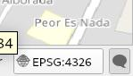
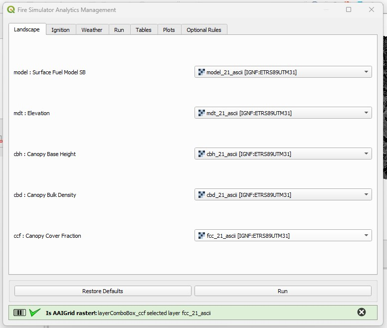
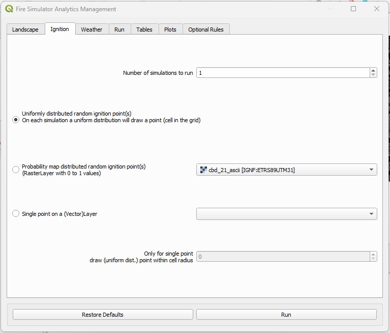
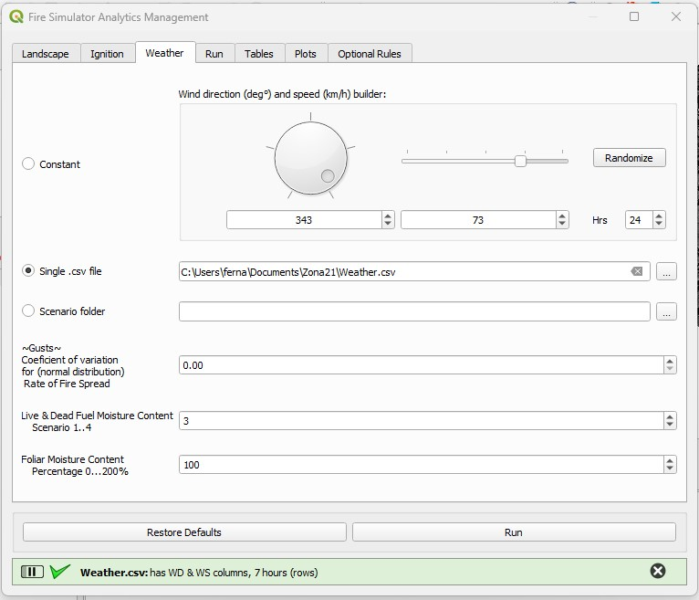
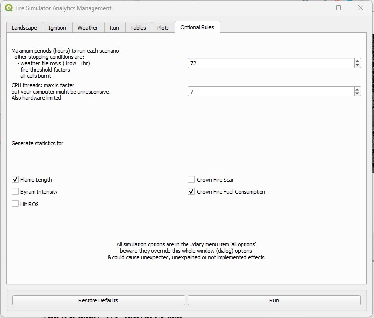
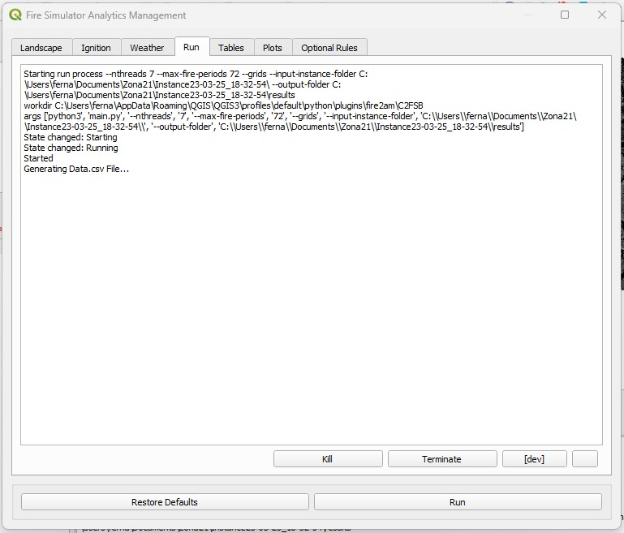
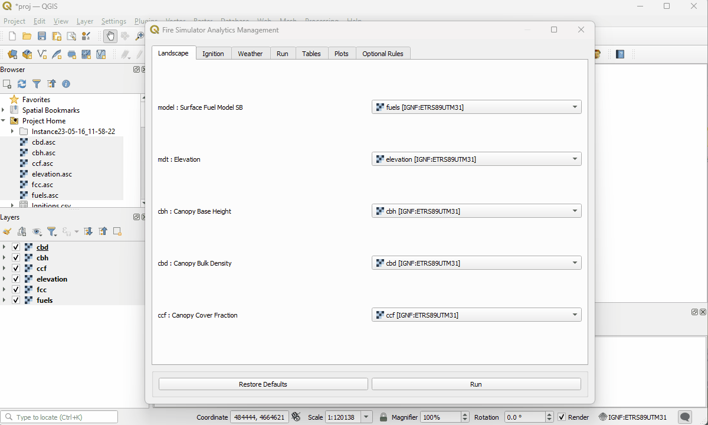

    Fire Advanced Analytics & Management
    
             fire2am QGIS plugin
            
        by fire2a.com research centre

                    USER GUIDE

Check [Getting the software](README.md#installation) first.  
Sample instances are included in the plugin folder `fire2am/C2FSB/data/`.  
_Most sections have a .gif animation at the end summarizing it._  

# Files Preparation
## 0. Formats
 
- Locale is plain english without special chars (á, é, ... ñ)  
- Dates are isoformated (YYmmDD HH:MM:SS)  
- Spanish localized files using `,` as decimal separator, __must be replaced to `.`__  
    - Linux solution: `$ sed -i -e 's/,/\./g' *.asc`

## 1. Project location  
- File and folder names __must avoid the space character__ (also avoid cloud folders that modify your files without asking)  
- The safest is to start in a empty folder and save a new empty qgis project. _This will enable the 'Project Home' folder in the 'Browser' panel (to drag & drop things into)._  
- Setup its Coordinate Reference System (CRS):  
     - By clicking on the bottom right corner (left to the 'Messages' button that opens the very useful log panel btw) world icon  
     - Or by `Menu > Project > Properties > CRS (on the vertical left tab)`  
     - Or keyboard shortcut `Ctrl+Shift+P`  

    Known used CRSs:
     - PREVINCAT : UTM 31N ETRS89
     - Chile North : PSAD56 / UTM zone 19S

| press both bottom right corner buttons |
| --- |
|  |


## 2. Instance Rasters  
- All layers must be ascii AAIGrid formatted .asc files with matching CRS, extent and resolution.  
        - _Use QGIS processing algorithm clip to polygon if they don't match!_  
        - Follow [this guide](prepare_rasters.md) to checking and converting rasters to avoid errors and improving processing speed.

- The header (first 6 lines) for asc files __must have 1 space__ between its data, i.e., `ncols_40` not `ncols____40`
    - _This happens on PREVINCAT data_
    - Linux solution `$ sed -i -e '1,6 s/\s\+/ /g' *asc`

1. Copy the ascii raster files into the 'Project Home' folder  
2. Drag and drop from 'Project Home' (Browser panel) into the 'Layers panel'  
3. Set up the proper CRS for each layer by: `Select layer(s) > 2dary click > 'Set CRS...'`  
    
__Expect errors (and people unwilling to help you) if layers and project CRS are not set!__

| setup a new project |
| --- |
|  |

## 3. Weather files
The simulator currently support a single wind direction and speed for the whole grid. This vector can change overtime and between scenarios.
- There are two flavors: whether a single `Weather.csv` file or a folder with sequentially numerated `Weather/Weather1..N.csv` files.  

    Headers: Instance,datetime,WD,WS,FireScenario  
    Instance: any string  
    datetime: YYYY-mm-DD[T]HH:MM:SS format without decimal seconds
    Wind Direction: 0-359 integer  
    Wind Speed: positive integer  
    FireScenario: integer (deprecated?)  

- _Deprecated but ask for this feature if you need it:_ Datetimes are used for timestamping the fire evolution polygons (isochrones or animation frames) on single fire simulations, so hourly separated data is recommended (if you use the same value for two rows, the animation won't work at post processing, but the simulation will be fine)  
- For PREVINCAT `.wnd` files a reformater script is provided on the `extras` folder of the plugin. Usage example:  
        ```
        python3 wnd2Weathercsv.py 40_10032007.wnd
        ```

# Usage overview
If not already, check the [broadest usage overview](README.md#broadest-usage-overview) of the introduction first.  
### 1. There are to ways of launching the Fire2am dialog:
a. Clicking on the fire2am icon , on the Plugins Toolbar  
b. `Menu > Plugins > Fire Simulator Analytics Management > setup and run a forest fire simulation`  
        
_The other menu item is for advanced tinkering of setup of parameters, the [developer dialog](readme_dev.md)._

### 2. The dialog appears
#### 2.1 Its layout in tabs, represents the typical workflow phases:  
- Instance setup: Layers and options for Landscape, Ingnitions and Weather  
- Run: simulator ouput window with control buttons  
- Results: Tables and plots (data that is not spatial)  
- Optional Rules: Such as 'number of cpu threads' or 'Crown Fire statistics'
        
#### 2.2 Its Buttons are:  
- `Restore Defaults` : Resets all changes, implemented because they are _persisted even if you close the dialog!_
        Useful because the simulation keeps running in the background even when the dialog is accidentally closed (the dialog not QGIS!)
        But you can get fixated on a persistent error that you can't debug
        There's a initial automatching layer regex process that runs only at startup
- `Run`, `Kill` & `Terminate` buttons are for managing the simulation process  
       
#### 3. Running the simulator  
When pressing 'Run' the following phases are executed:  
1. All user interface selections are gathered, compared with the simulator defaults and the simulator command line options string is generated  
                - _All selected arguments are overriden by the 2dary developer dialog if opened _  
2. A timestamped folder named `Instance_YY_mm_DD_HH_MM_SS` is made, storing instance all files  
                - Besides the -already saved- project file  
                - Achieving reproducibility of the experiment  
                - Renaming is possible after finishing the simulation (remember manually updating currently loaded layer's file sources paths)  
3. The simulator is ran as an external QProcess (emulating a command line call), where its outputs are displayed on the "Run" tab  
4. Afterwards, several QGIS background tasks store and loads the results  
                - A `results` folder inside the `Instance_<timestamp>` folder was made  
                - Each spatial output category is being stored inside its own `SQL geopackage`, any remaining csv files can be deleted  
                - If a single fire was ran, its evolution is added to the current project  
                - Else if multiple fires were ran, the burn mean probability is added to the current project  
            
# Detailed dialog description  
## Landscape  
  

The first tab of the dialog, provides layer combo boxes with all available layers added to the project (distinct than files in the project folder!), for selecting:  

        - 'Surface fuel model SB'  
        - 'Elevation'  (can be set to none)  
        - 'Canopy Base Height'  (can be set to none)  
        - 'Canopy Bulk Density'  (can be set to none)  
        - 'Canopy Cover Fraction'  (can be set to none)  

Only fuels layer is mandatory.  
For enabling crown fire behavior you must have at least one canopy layer. Otherwise to disable crown fire behavior make sure the canopy layers are set to none.

_Again, make sure they're AAIGrid ascii formated files, they have the same CRS and extent._  

Also, on the first opening of the dialog, the plugin will try to match the available layers using it's names, with the following regular expressions:  

        - 'Surface fuel model SB' : Any layer that has 'model' and 'asc' (ordered) in its name ~ `model.*asc`. Or `[Ff]uel`  
        - 'Elevation' : `mdt.*asc` or `[Ee]levation`  
        - 'Canopy Base Height' : `^cbh` (name starts with cbh)  
        - 'Canopy Bulk Density' :`^cbd`  
        - 'Canopy Cover Fraction' : `^ccf`  

You can trigger this behavior again via `Restoring Defaults` button (for example, useful when opening a new project on another location or putting new files on the project folder).  
And naming your rasters according this convention is encouraged (PREVINCAT users are welcome🗿).

## Ignition  
  

The second tab of the dialog, sets the ignition model options for the simulation. This is the most important setting for the software `Number of simulations to run`:  

        - If set to 1 (default) only one simulation will be run and the fire scar isochrones will be returned  
        - Else various simulations will be ran and the burn probability map will be calculated  
        
_At your own risk: These behaviors can be mixed by the Expert dialog (--grids & nsim>1) but is really time consuming and SQL threading collisions may lose some fire scars or crash QGIS, although sequential animations of each fire looks very good_
        
The ignition point can be setup as:  

1. Picked at random, drawing from a _uniform probability distribution_  
2. Picked at random using a _spatial probability distribution_ raster layer (each cell with values between 0 to 1)  
3. Set by a _SINGLE_ point from a vector layer (can be of any type GeoPackage, Shapefile, SpatiaLite or temporary scratch layer, _Again: but using the same CRS!_).  
        - This last option additionally has the 'adjacency radius' that enables igniting many fires inside a delimited area (>10 could yield slow processing).  

## Weather  
  
The third tab of the dialog enables selecting the weather related things for the simulation. Its main setting is the `weather file type` provided by selecting one of the three radio button:  

1. _Constant_: enables the creation 'on the fly' of a weather file; selecting the wind speed, direction and lenght (by number of rows=hrs) of the created file  
2. _Single_ csv: provides a file selector. Can be anywhere and any file with the csv extension, will be copied and renamed to Weather.csv. Header consistency is checked  
3. _Scenarios_ folder: provides a folder selector. Can be anywhere but must contain sequentialy numerated Weather1..N.csv files. Warning: header consistency is not checked at this time (for slowing down to much). The folder is copied as is  

Also below can be set:  
    - The Coeficient of variation for (normal distribution) Rate of Fire Spread: That emulates wind Gusts (a good setting is 0.34)  _The higher the unpredictable the fire direction behavior gets_  
    - Surface Moisture Content Scenario: a integer number between 1 and 4, default 3. _The lower the drier or more burn_  
    - Foliar Moisture Content Percentage: a integer number between 0 200, default 100 (60 to 150 is sensible). _The lower the drier or more burn_  

## Optional Rules
  
This dialog is at the end because it can be avoided altogether but provides several performance critical options:  

- A simulation stopping rule  
- A CPU hog rule: If you want a nice background simulation, while using the PC for other stuff, lower it down! Each simulation runs in parallel using a thread. Defaults to use all available CPU threads minus one (for QGIS)  

Several statistical indicators: These could take longer to calculate than the simulation itself:
- For the Crown options to make sense, make sure you have at least one canopy type layer  
- Also available Flame lenght, Byram intensity & Hit ROS
    
## Run  
  
This tab enables running the cell2fire simulator, showing its "live" output on the text area provided by the dialog. Providing:  
    - 'Run' : starts the process  
    - 'Terminate' and 'Kill' : two level of priority for aborting the process while it runs.  
    - '[dev]' advanced run that can override the creation of the Instance_timestamp folder, used in conjunction with the [developer dialog](readme_dev.md)

A typical run outpus:  

    ```
    Starting run process --nthreads 7 ... # this is the python calling argument
    workdir # this is where te c++ simulator is located
    State changed: Starting
    State changed: Running
    Started
    Generating Data.csv File...
    Calling Cell2Fire Simulator
    End of Cell2Fire
    Calculating statistics...
    ```  

This is the simulation log, if you want the full log including the plugin, use the log panel.  
It is normal for small number of simulations (<100) that the time spent in Cell2Fire can be even less than the postprocessing!  

## Outputs
### Animating a fire isochrone
When simulating just one fire  (the default value on Ignitions > Number of simulations : 1), the evolution of the fire is returned (thanks to the --grids command line option). You can animate the isochrone following this guide:
  

## Known issues  
- Directories or folders with spaces won't work
- Don't close the current project with the dialogs opened  
- Don't try opening the results directory while the simulation is running, specially -after the simulation- while postprocessing statistics
- Windows version fails around 3564288 cells, a rule of thumb for a cup-of-coffee length run is less than 1000x1000 raster with 100 simulations.
